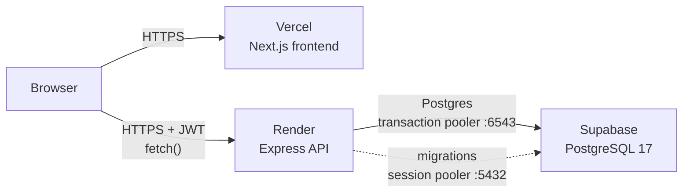
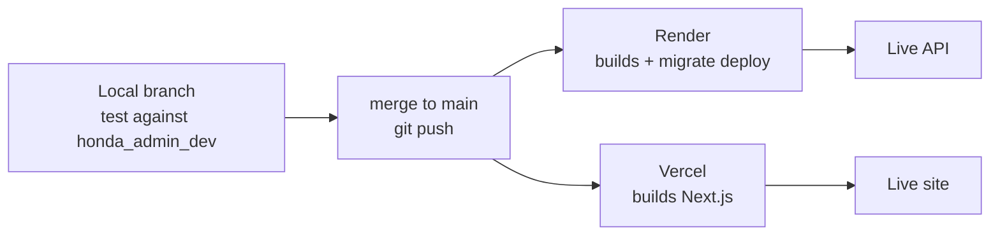

# Honda Admin — Project Handbook

End-to-end reference for the Honda Workshop Planning and Management system:
how it is built, where it runs, how to develop against it, and how to deploy,
maintain and troubleshoot it.

Companion documents:

- [RUNNING.md](RUNNING.md) — first-time local setup, condensed
- [DEPLOYMENT.md](DEPLOYMENT.md) — first-time deployment walkthrough
- [README.md](README.md) — project overview

This handbook is the authoritative reference where they disagree.

---

## 1. What the system is

A workshop management application for a Honda motorcycle service centre.
It covers parts inventory, purchases from vendors, job cards, mechanics,
sales invoices with payments, daily cash, expenses, and reporting.

| Layer | Technology | Notes |
| --- | --- | --- |
| Frontend | Next.js 16 (App Router), React 19, Tailwind 3 | 25 routes, TypeScript |
| Backend | Node 20+, Express 4, Prisma 6 | Modular: 15 feature modules |
| Database | PostgreSQL 17 | 18 models |
| Auth | JWT (HS256), bcrypt | Role-based permissions |

Repository layout:

```
apps/
  web/    Next.js frontend
  api/    Express + Prisma backend
    prisma/
      schema.prisma          single source of truth for the schema
      migrations/            applied in order by `prisma migrate deploy`
      seed.cjs               DEV ONLY — creates password123 accounts
      seed-admin.cjs         production-safe — one admin from env vars
render.yaml                  Render Blueprint for the API service
```

---

## 2. Architecture



The frontend is **static and client-rendered**: it never talks to the database.
Every data operation is a `fetch()` from the user's browser directly to the API,
carrying a JWT in the `Authorization` header. This matters in two ways:

- The API URL is **public**, baked into the JavaScript bundle. It is not a secret.
- The API must allow the frontend's origin via CORS, or every request fails in the
  browser while working fine from `curl`.

### Request flow for a login

1. Browser posts to `POST {API}/api/v1/auth/login`
2. API looks up the user, compares the bcrypt hash, signs a JWT (24h expiry)
3. Browser stores the token in `localStorage` under `wpm_token`
4. Every later request sends `Authorization: Bearer <token>`
5. `authenticate` verifies the signature; `checkPermission` checks the role;
   `enforceShopScope` confines the user to their own shop

### Live locations

| Component | Where |
| --- | --- |
| Web | `https://honda-admin-web.vercel.app` |
| API | `https://honda-admin-api.onrender.com` |
| API health | `https://honda-admin-api.onrender.com/api/v1/health` |
| Database | Supabase, region `ap-southeast-1` |
| Repository | `github.com/mwaqas3562/Honda-Admin` (public) |

---

## 3. Environments

There are exactly two: **local** and **production**. There is no staging
environment — changes are tested locally and then go live on merge to `main`.

| | Local | Production |
| --- | --- | --- |
| Frontend | `localhost:3000` (`next dev`) | Vercel |
| API | `localhost:4000` (`ts-node-dev`) | Render (free plan) |
| Database | local PostgreSQL, `honda_admin_dev` | Supabase PostgreSQL 17 |
| Data | throwaway test data | real workshop data |
| `NODE_ENV` | `development` | `production` |
| CORS | `http://localhost:3000` | the Vercel origin only |

**The two databases are completely independent.** The local API is configured
with `postgresql://...@localhost:5432/honda_admin_dev` and holds no Supabase
credentials, so nothing done locally — including dropping the database — can
reach production.

The only path from local to production is deliberately using the production
credentials stored in `apps/api/.env.production.local`, which no command reads
automatically. **If `apps/api/.env` says `localhost`, production cannot be
touched.** Check it before running anything destructive:

```bash
grep DATABASE_URL apps/api/.env
```

### A note on Vercel preview deployments

Vercel builds a preview URL for every branch pushed to GitHub. Those previews use
the **production** API and therefore **production data**, because
`NEXT_PUBLIC_API_BASE_URL` is set for both Production and Preview environments.
A preview is not a sandbox. Deleting a part there deletes it for real.

Render's free plan does not create preview environments, so API changes cannot be
previewed at all — test those locally.

---

## 4. Environment variables

### API (`apps/api`)

Validated at boot by [`src/config/env.ts`](apps/api/src/config/env.ts) with Zod.
The process **refuses to start** if validation fails, which is deliberate: a
missing secret should stop the deploy, not produce a silently insecure server.

| Variable | Required | Purpose |
| --- | --- | --- |
| `DATABASE_URL` | yes | Runtime queries. In production, Supabase **transaction pooler**, port 6543, with `?pgbouncer=true&connection_limit=1` |
| `DIRECT_URL` | yes | Migrations and seeding. Supabase **session pooler**, port 5432 |
| `JWT_SECRET` | yes | Token signing. Minimum 32 characters |
| `JWT_EXPIRES_IN` | no | Token lifetime, default `1d` |
| `PORT` | no | Default 4000. Render supplies its own |
| `NODE_ENV` | no | `development` or `production` |
| `CORS_ORIGINS` | no | Comma-separated allowed origins, default `*` |
| `BCRYPT_COST` | no | Default 12 |

Two production guards in `env.ts`: when `NODE_ENV=production`, the API refuses to
boot if `CORS_ORIGINS` is `*`, or if `JWT_SECRET` looks like a placeholder.

### Web (`apps/web`)

| Variable | Required | Purpose |
| --- | --- | --- |
| `NEXT_PUBLIC_API_BASE_URL` | yes in production | Base URL of the API, **including the `/api/v1` suffix** |

**This is compiled into the JavaScript bundle at build time, not read at
runtime.** Changing it in Vercel's settings has no effect until the frontend is
redeployed. If it is missing, the app falls back to `http://localhost:4000/api/v1`
— which on a deployed site points every visitor's browser at their own machine.
[`api-base.ts`](apps/web/src/lib/api-base.ts) logs an explicit `[config]` error to
the browser console when it detects this, because the failure is otherwise silent.

For historical reasons `NEXT_PUBLIC_API_URL` is also accepted as a fallback name.
Prefer `NEXT_PUBLIC_API_BASE_URL`.

### Where the real values live

| File / location | Contents | Committed? |
| --- | --- | --- |
| `apps/api/.env` | **local** development values | no (gitignored) |
| `apps/api/.env.production.local` | production Supabase credentials, kept for deliberate use | no (gitignored) |
| `apps/web/.env.local` | local API URL | no (gitignored) |
| Render → service → Environment | production API values | n/a |
| Vercel → project → Settings → Environment Variables | production web values | n/a |
| `render.yaml` | non-secret production config (`NODE_ENV`, `CORS_ORIGINS`) | yes |

Never commit a `.env` file. The repository is public.

---

## 5. The database

### Production: Supabase

PostgreSQL 17, region `ap-southeast-1`. Connect through one of two poolers —
**never the "Direct connection" URL**:

| Use | Pooler | Port | Why |
| --- | --- | --- | --- |
| Application queries | Transaction | 6543 | Short-lived queries; add `?pgbouncer=true&connection_limit=1` so Prisma stops using prepared statements |
| Migrations, seeding, `psql` | Session | 5432 | Needs a real session; the transaction pooler cannot run migrations |
| ~~Direct connection~~ | — | 5432 | **IPv6-only** without the paid IPv4 add-on. Render's free plan has no IPv6 egress, so migrations hang and fail with "Can't reach database server" |

That last row caused real confusion during setup and is easy to hit again: the
Supabase dashboard presents the direct URL first, and it resolves to an AAAA
record with no A record at all.

Passwords containing `# ! @ : / ? [ ] %` must be **URL-encoded** in the
connection string (`#` → `%23`, `!` → `%21`, `@` → `%40`). A raw `#` silently
truncates the string at that point.

### Local: your own PostgreSQL

Database `honda_admin_dev` on `localhost:5432`. Safe to wipe and rebuild at any
time. No pooler, so `DATABASE_URL` and `DIRECT_URL` are identical.

### Schema

18 models. The core chain is
`Shop → Role → User`, then `Part`, `Vendor`, `Purchase`/`PurchaseItem`,
`Customer`, `JobCard`, `Mechanic`, `Invoice`/`InvoiceItem`/`Payment`,
`StockLog`, `CashEntry`, `Expense`, `Service`, and `NumberSequence` for
per-shop document numbering.

Every business table carries `shopId`, `isDeleted` and `createdById`, so the
data model supports soft deletion and multi-shop scoping.

---

## 6. Setting up a development machine

Prerequisites: Node 20.9+, npm 10+, PostgreSQL 14+, Git.

```bash
git clone https://github.com/mwaqas3562/Honda-Admin.git
cd Honda-Admin
npm install
```

`npm install` runs `prisma generate` automatically via a `postinstall` hook. This
is required, not cosmetic: without it the API build fails with a few hundred
`Namespace 'Prisma' has no exported member` errors.

Create the local database:

```bash
createdb honda_admin_dev
```

Create `apps/api/.env`:

```env
PORT=4000
NODE_ENV=development

DATABASE_URL=postgresql://<your-user>@localhost:5432/honda_admin_dev
DIRECT_URL=postgresql://<your-user>@localhost:5432/honda_admin_dev

JWT_SECRET=<any 32+ character string for local use>
JWT_EXPIRES_IN=1d
CORS_ORIGINS=http://localhost:3000
```

Create `apps/web/.env.local`:

```env
NEXT_PUBLIC_API_BASE_URL=http://localhost:4000/api/v1
```

Build the schema and create an account:

```bash
cd apps/api
npx prisma migrate deploy
ADMIN_EMAIL='dev@local.test' ADMIN_PASSWORD='dev-password-1234' \
  ADMIN_NAME='Local Dev' SHOP_NAME='Dev Workshop' npm run seed:admin
cd ../..
```

Run it, in two terminals:

```bash
npm run dev:api     # http://localhost:4000
npm run dev:web     # http://localhost:3000
```

Do **not** run `prisma/seed.cjs`. It creates four accounts with the password
`password123`, which is published in this public repository. It exists only for
throwaway local databases and must never reach a shared one.

### Rebuilding the local database from scratch

Takes about ten seconds and is the fastest fix for any local data problem:

```bash
dropdb honda_admin_dev && createdb honda_admin_dev
cd apps/api && npx prisma migrate deploy
ADMIN_EMAIL='dev@local.test' ADMIN_PASSWORD='dev-password-1234' npm run seed:admin
```

---

## 7. Database migrations

### How the history works

`schema.prisma` is the source of truth. `prisma/migrations/` holds the SQL that
builds a database up to that schema, applied in folder-name order.

The history was **baselined** on 2026-09-13. Six earlier migrations were replaced
by a single `00000000000000_baseline` migration generated from `schema.prisma`.

The reason: six of eighteen models (`CashEntry`, `Expense`, `InvoiceItem`,
`NumberSequence`, `Payment`, `Service`) and three enums had no `CREATE TABLE` in
any migration. They existed in production only because the schema had been applied
with `prisma db push` while migrations were written separately. That left the
history unable to rebuild the database — `migrate deploy` on an empty database
died at `relation "NumberSequence" does not exist` — and, because `migrate dev`
replays the whole history into a shadow database, it also made creating any new
migration impossible.

The baseline was marked as already applied on production with
`prisma migrate resolve --applied`, which writes one bookkeeping row and runs no
schema SQL. The six stale rows remain in `_prisma_migrations`; they are harmless.

### Making a schema change

```bash
# 1. edit apps/api/prisma/schema.prisma

# 2. generate the migration against your LOCAL database
npm --workspace apps/api run prisma:migrate     # prisma migrate dev

# 3. commit the generated folder together with the code that needs it
git add apps/api/prisma/migrations apps/api/prisma/schema.prisma
git commit -m "Add X column"
git push origin main

# 4. Render applies it on the next boot via `prisma migrate deploy`
```

### Rules

**Never run `prisma migrate dev` against production.** It is the development
command: when it detects drift it offers to reset the database, which would
destroy all workshop data. Production only ever sees `migrate deploy`, which
applies pending migrations and nothing else.

**Migrations are forward-only.** Reverting a commit does not revert the database.
To undo a schema change, write a new migration that reverses it.

**Some migrations destroy data regardless of tooling** — dropping a column,
narrowing a type, adding `NOT NULL` to a populated table. Take a backup first
(section 9).

**Two branches each adding a migration will conflict.** Prisma applies them in
folder-name order; if they merge out of order, `migrate deploy` can fail on
production. Not a concern with a single developer.

### Useful commands

```bash
cd apps/api
npx prisma migrate status     # what is applied, what is pending
npx prisma studio             # browse the local database in a GUI
npx prisma generate           # regenerate the client after schema changes
```

---

## 8. How a change reaches production



Both hosts watch `main` and deploy automatically on push. There is no manual
release step.

### The loop

```bash
git checkout main && git pull
git checkout -b fix/invoice-rounding

# work, with npm run dev:api + npm run dev:web running

npm run build:all          # type-check both apps before pushing
git commit -am "Fix invoice rounding"
git push -u origin fix/invoice-rounding     # deploys nothing to production

# when satisfied:
git checkout main && git merge fix/invoice-rounding && git push origin main
```

`npm run build:all` matters: it catches the type errors that would otherwise fail
the hosted build several minutes later.

### What each host does

**Render** (config in [`render.yaml`](render.yaml)):

```
build:  npm ci --include=dev --include-workspace-root --workspace apps/api
        && npm --workspace apps/api run build
start:  prisma migrate deploy && node dist/server.js
health: /api/v1/health
```

`--include=dev` is load-bearing. `render.yaml` sets `NODE_ENV=production`, and npm
reads that variable to omit devDependencies — which drops `typescript`, the
`@types/*` packages and the `prisma` CLI, failing the build at `tsc`. The workspace
flags install only the API's dependencies, so Next.js is never pulled onto the API
server.

**Vercel**: Root Directory `apps/web`, framework preset Next.js, everything else
default.

### Deploy safety

A failed build **does not take the site down**. Both hosts keep serving the
previous version and only swap on success. A failed migration fails the deploy the
same way.

### Rolling back

- **Vercel** → Deployments → last good one → ⋯ → Promote to Production
- **Render** → service → Events → last successful deploy → Rollback

Rolling back code does **not** roll back the database. If the bad deploy included a
migration, the schema change remains — write a new migration to reverse it.

---

## 9. Backups and restore

Supabase's free plan does not include automated backups or point-in-time
recovery; those are Pro features. Take your own before anything risky.

`pg_dump` will not work from a stock macOS setup here: Supabase runs PostgreSQL
17 and Homebrew's client is 14, and `pg_dump` refuses to dump from a newer
server. `psql` works fine cross-version, so export with `COPY` instead:

```bash
export PGPASSWORD='<db password, raw — not URL-encoded>'
PSQL_ARGS="-h aws-1-ap-southeast-1.pooler.supabase.com -p 5432 -U postgres.<project-ref> -d postgres"
DIR="backups/supabase-$(date +%Y%m%d-%H%M%S)"
mkdir -p "$DIR"

psql $PSQL_ARGS -Atc "select tablename from pg_tables where schemaname='public' order by 1;" > /tmp/t.txt
while IFS= read -r t; do
  psql $PSQL_ARGS -q -c "\copy \"$t\" TO '$DIR/$t.csv' CSV HEADER"
done < /tmp/t.txt
cp apps/api/prisma/migrations/00000000000000_baseline/migration.sql "$DIR/schema.sql"
```

`backups/` is gitignored. **It contains real customer and pricing data and must
never be committed** — the repository is public.

To restore into an empty database: apply `schema.sql`, then `\copy ... FROM` each
CSV in dependency order (`Shop`, `Role`, `User` first, then the rest), or disable
triggers for the load with `SET session_replication_role = replica;`.

For a production system holding real financial records, consider upgrading
Supabase to Pro for daily backups and PITR, or scheduling this export.

---

## 10. Security model

### Roles

Four roles, defined in [`role.ts`](apps/api/src/shared/types/role.ts):

| Role | read | write | delete |
| --- | :-: | :-: | :-: |
| `SUPER_ADMIN` | ✅ | ✅ | ✅ |
| `SHOP_ADMIN` | ✅ | ✅ | ✅ |
| `STOREKEEPER` | ✅ | ✅ | ❌ |
| `JOB_CARD_MANAGER` | ✅ | ✅ | ❌ |

Understand what this actually gives you: there are **two effective permission
levels, not four**. SUPER_ADMIN and SHOP_ADMIN are identical; so are STOREKEEPER
and JOB_CARD_MANAGER. And permissions are **global, not per-module** — the same
`checkPermission("write")` guards every route, so a storekeeper can create
invoices, edit job cards and record expenses. The role names imply a
specialisation the code does not implement.

### Enforcement

Every module applies `authenticate` → `checkPermission` → `enforceShopScope`.
Only `/api/v1/health` and `/api/v1/auth/login` are unauthenticated. Frontend role
checks ([`useUserRole`](apps/web/src/hooks/useUserRole.ts)) read from
`localStorage` and are cosmetic only — the API enforces independently.

### Hardening already in place

- `helmet` security headers
- Login rate limit: 10 attempts per 15 minutes per IP
- General API rate limit: 300 requests per minute
- Request bodies capped at 1 MB
- bcrypt cost 12
- Failed and successful logins are audit-logged
- CORS restricted to the Vercel origin; wildcard refused in production

### Secrets inventory

| Secret | Where it lives | Rotate by |
| --- | --- | --- |
| Supabase DB password | Render env vars, `apps/api/.env.production.local` | Supabase → Settings → Database → Reset password, then update both |
| `JWT_SECRET` | Render env vars (generated by Render) | Change it in Render — logs out every user |
| Supabase `sb_secret_` API key | not used by this app | Supabase → Settings → API Keys |
| Admin password | your password manager only | re-run `seed:admin` with a new password |

There is no password-reset flow in the application. Losing the admin password
means re-running `seed:admin` with database credentials.

---

## 11. Troubleshooting

Every entry below is a failure actually hit while building and deploying this
system, with the symptom that was visible at the time.

### The live site loads but nothing works; console shows CORS errors

`CORS_ORIGINS` on the API does not match the frontend's origin. Set it in
`render.yaml` (or Render → Environment) to the exact origin — scheme included, no
trailing slash. Comma-separate multiple origins.

Firefox and Chrome cache preflight responses, so after fixing it, hard-reload
(`Cmd/Ctrl + Shift + R`) or use a private window, otherwise you replay the old
failure.

### Requests go to `localhost:4000` on the deployed site

`NEXT_PUBLIC_API_BASE_URL` was not set at **build** time. Set it in Vercel and
**redeploy** — it is compiled into the bundle, so a restart is not enough. The
browser console will carry an explicit `[config]` error in this case.

### Build fails with `tsc: not found` or hundreds of type errors

Two separate causes:

- `Namespace 'Prisma' has no exported member ...` → the Prisma client was not
  generated. Run `npm --workspace apps/api run prisma:generate`. The `postinstall`
  hook normally handles this.
- `tsc: not found` on a host → devDependencies were omitted because
  `NODE_ENV=production`. The build command needs `--include=dev`.

### Migrations hang, then fail with "Can't reach database server"

You are using Supabase's **direct connection** URL. It is IPv6-only without the
paid add-on, and Render has no IPv6 egress. Use the session pooler
(`aws-1-<region>.pooler.supabase.com:5432`) for `DIRECT_URL`.

### `password authentication failed for user "postgres"`

Either the password is genuinely wrong, or special characters were not
URL-encoded in the connection string. To separate the two, test with `psql` and
`PGPASSWORD`, which sends the password literally and bypasses URL parsing:

```bash
PGPASSWORD='<raw password>' psql -h aws-1-<region>.pooler.supabase.com \
  -p 5432 -U postgres.<project-ref> -d postgres -c "select 1;"
```

If that works but the app fails, the problem is encoding. If it fails too, reset
the password in the Supabase dashboard — and make sure the reset dialog is
actually submitted; typing a value and navigating away changes nothing.

### `tenant or user not found`

Wrong pooler host. Supabase projects sit on either `aws-0-<region>` or
`aws-1-<region>`; the wrong one rejects the tenant outright. Copy the exact host
from the dashboard's **Connect** panel.

### First request of the day takes 30-50 seconds

Render's free plan sleeps the service after 15 minutes idle. This is expected,
not a fault. Eliminate it by upgrading to Render's Starter plan (~$7/month) or
moving to an always-on host.

### `migrate deploy` fails with `type "X" already exists`

A migration is trying to create objects that already exist — the database was
built outside the migration history. Baseline it (section 7): generate a baseline
from `schema.prisma` and mark it applied with `prisma migrate resolve --applied`
**before** pushing, never after.

### `git push` rejected with 403

The authenticated GitHub account differs from the repository owner, or lacks
write access. Check with:

```bash
gh api repos/<owner>/<repo> --jq '.permissions'
```

`"push": false` means the account needs to be added as a collaborator with the
Write role.

### Where to look

| Symptom | Look at |
| --- | --- |
| API errors, 500s | Render → service → Logs (every request is logged) |
| Frontend build failure | Vercel → Deployments → the failed build's log |
| Data questions | Supabase → Table Editor or SQL Editor |
| Auth failures | Render logs — `[AUDIT] login_ok` / `login_failed` lines |

---

## 12. Known limitations

Honest inventory of what this system does not do, as of 2026-09-13.

**No user management.** There is no endpoint or screen to create users, change
passwords, or assign roles — only `/auth/login` and `/auth/me` exist. Onboarding
a staff member requires a developer to run `seed-admin.cjs` with database
credentials. This is the most operationally limiting gap.

**No password reset.** A forgotten password needs developer intervention.

**Sessions expire daily.** `JWT_EXPIRES_IN=1d` with no refresh token, so everyone
logs in again each day.

**Permissions are coarse.** Two effective levels, applied globally rather than
per module (section 10).

**No audit trail for edits or deletions.** Records store `createdById`, but
nothing logs who changed or removed a row afterwards.

**Multi-shop support is scaffolding.** `shopId` and `enforceShopScope` exist and
SUPER_ADMIN bypasses scoping entirely, but the system runs a single shop and a
second one would need real work.

**Tokens live in `localStorage`**, which is readable by any script running on the
page — the standard XSS trade-off for this pattern.

**No automated tests.** No test suite, no CI. `npm run build:all` type-checking is
the only safety net before deploying.

**No staging environment.** Changes go from local to production on merge. Vercel
previews exist but point at production data, so they are not a safe rehearsal.

**No error tracking.** No Sentry or equivalent; production errors surface only in
Render's logs if someone looks.

---

## 13. Quick reference

```bash
# Development
npm run dev:api                  # API on :4000
npm run dev:web                  # web on :3000
npm run build:all                # type-check both before pushing

# Database (from apps/api)
npx prisma migrate status        # applied vs pending
npx prisma migrate dev           # create a migration (LOCAL ONLY)
npx prisma migrate deploy        # apply pending migrations
npx prisma studio                # browse data in a GUI
npx prisma generate              # regenerate the client

# Accounts
ADMIN_EMAIL='you@example.com' ADMIN_PASSWORD='<12+ chars>' \
  npm --workspace apps/api run seed:admin

# Checks
curl https://honda-admin-api.onrender.com/api/v1/health
grep DATABASE_URL apps/api/.env          # confirm local before anything risky

# Reset the local database
dropdb honda_admin_dev && createdb honda_admin_dev
cd apps/api && npx prisma migrate deploy
```

| Need | Go to |
| --- | --- |
| API logs, env vars, redeploy | Render dashboard → `honda-admin-api` |
| Web deploys, env vars | Vercel dashboard → the project |
| Data, backups, DB password | Supabase dashboard |
| Code, deploy triggers | `github.com/mwaqas3562/Honda-Admin` |
